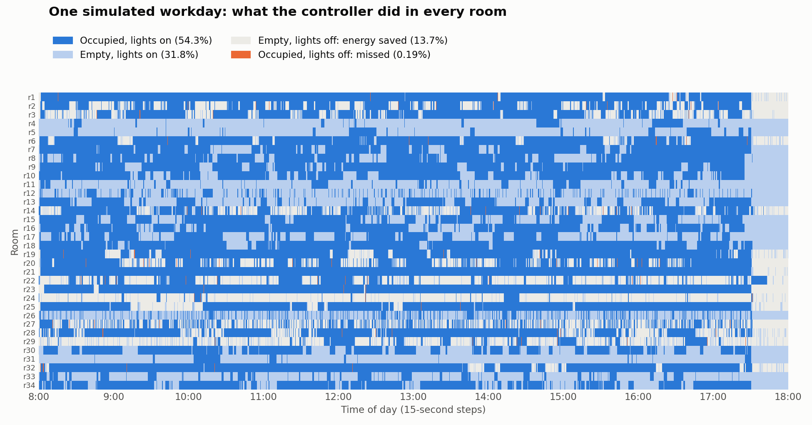

# Smart Building Energy Optimisation

Turning lights on and off across a 34-room office building using noisy, partial sensor data. Each room's occupancy is tracked with a **Hidden Markov Model**, and the lights are switched with an **expected-cost decision rule** that weighs the cost of electricity against the productivity lost when people sit in the dark.

> UNSW COMP9418 Advanced Topics in Statistical Machine Learning, Assignment 2 (Term 2, 2025). Full write-up: [`Smart_Building_Report.pdf`](Smart_Building_Report.pdf)

**Result:** across two simulated workdays, the controller cut total cost by **12.7%** compared with leaving every light on, used **14% less electricity**, and kept the lights on for **99.6%** of the time that rooms were occupied.



*Every row is a room and every column is a 15-second step. Dark blue: people in the room with the lights on. Grey: an empty room with the lights off, which is where the savings come from. Orange (0.19% of the time): someone was in a dark room.*

---

## The problem

The building has 34 rooms, 2 corridors and 50 people, simulated from 8:00 to 18:00 in 15-second steps (2,400 steps a day). At every step the controller receives a reading from each sensor and must decide, for every room, whether the lights should be on.

| Cost | Amount |
|---|---|
| A light that is on | 1 cent per step |
| A light that is off while people are in the room | 4 cents per person per step |

The sensors are deliberately imperfect:

| Sensor | Count | Reports |
|---|---|---|
| Motion | 6 | Motion or no motion in one room |
| Door | 10 | Number of people passing between two areas |
| Camera | 4 | Number of people seen in one room |
| WiFi | 6 | Whether a device is connected in one room |
| Robot | 2 | Exact head count in whichever room it is currently visiting |

Most rooms have no dedicated sensor, and at every step one random sensor fails and returns nothing.

## Approach

1. **Binarise the sensors.** Every reading becomes 0 or 1 (motion detected, someone counted, device present), giving the models a consistent input.
2. **Map sensors to rooms.** Using the floor plan, each room is assigned the sensors that are inside it, plus the door sensor a person would most likely pass to reach it.
3. **One HMM per room.** The hidden state is occupied or unoccupied. For each room:
   - **Transition probabilities** are learned by counting state changes in the two days of training data.
   - **Emission probabilities** P(sensor readings | state) are learned by counting how often each combination of sensor readings appears in each state, with Laplace smoothing.
   - Using 34 independent 2-state HMMs instead of one joint model avoids a state space of 2³⁴ combinations, and keeps inference to O(rooms × steps).
4. **Forward algorithm.** At each step, every room's belief is updated with its sensor evidence. A failed sensor reads as no activity, so the model keeps working when a reading is missing.
5. **Expected-cost decision.** The lights are switched on when the expected productivity loss of leaving them off is greater than the expected electricity wasted by turning them on. The rule is set conservatively, because a dark occupied room costs far more than a lit empty one.
6. **Robot override.** When a robot reports people in a room, that room's lights are switched on regardless of the model.

## Results

Run with `python evaluate.py`. Costs are in cents for a full day.

| | Day 1 | Day 2 |
|---|---|---|
| Lights always off | 406,076 | 416,624 |
| Lights always on | 81,600 | 81,600 |
| **HMM controller** | **71,206** | **71,137** |
| Saving vs always on | 12.7% | 12.8% |
| Electricity used vs always on | 86.1% | 86.2% |
| Occupied room-steps with lights on | 99.6% | 99.7% |

These figures come from replaying the two recorded days the model was trained on, so they are in-sample. The marker's own simulator generates fresh days.

**Where the savings come from.** Rooms with their own motion sensor, camera or WiFi sensor (for example r22, r24 and r29) are switched off for long periods when they are empty. Rooms covered only by a shared door sensor (for example r4, r5 and r7 to r13) carry little evidence, so the conservative rule keeps their lights on for most of the day. Better evidence for those rooms is the main opportunity for further savings.

## Repository contents

| File | What it does |
|---|---|
| `solution.py` | Learns the per-room HMMs from the data and implements `get_action(sensor_data)`, the controller called at every step |
| `HiddenMarkovModel.py` | HMM class with the forward algorithm |
| `DiscreteFactors.py` | Discrete factor operations (join, marginalise, evidence) used by the HMMs, provided with the course |
| `evaluate.py` | Replays a recorded day through the controller and compares its cost with the always-on and always-off baselines |
| `data1.csv`, `data2.csv` | Two recorded workdays: every sensor reading and the true number of people in each room at every step |
| `Smart_Building_Report.pdf` | Report covering the model design, its assumptions and its limitations |

## Running it

```bash
pip install -r requirements.txt
python evaluate.py
```

`solution.py` learns the models when it is imported, so run commands from the repository root, where the data files are. A full evaluation of both days takes about 30 seconds.

## Limitations and next steps

- **Rooms are treated as independent.** People moving from a corridor into a neighbouring room are not modelled. A factored or coupled HMM could share evidence between adjacent rooms without needing the full joint state.
- **Door sensors are assigned by hand** from the floor plan. Learning which sensors are informative for each room would remove this guesswork.
- **Time of day is ignored.** Occupancy at 8:00 differs from occupancy at 12:30, so time-dependent transition probabilities would sharpen the predictions.
